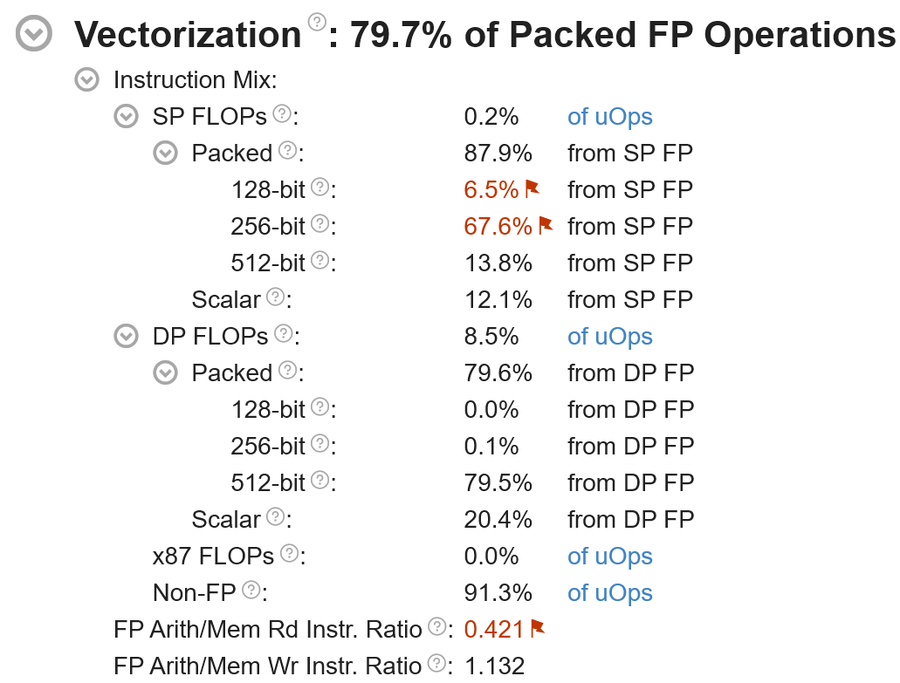

# mpv-winbuild

[](https://github.com/zhongfly/mpv-winbuild/actions)
[](https://github.com/zhongfly/mpv-winbuild/releases/latest)
[](https://github.com/zhongfly/mpv-winbuild/releases)

Use Github Action to build apps for Windows with latest commit.

- mpv
  - PGOed for some use cases
  - with libsixel (PGOed)
  - with win32-subsystem=console (24H2 consoleAllocationPolicy) to get rid of mpv.com wrapper to improve vo=sixel user experience
  - with more complete debuginfo for all deps for profiling and debugging
  - with rubberband
    - use [SLEEF](https://github.com/shibatch/sleef) DFT as FFT library
    - ~~up to 200% faster performance~~ (llvm removed veclib vectorization support)
- mpv-menu-plugin
- mpv-debug-plugin
- ffmpeg
  - PGOed for some codecs
  - with frei0r
  - patches from [dyphire/mpv-winbuild](https://github.com/dyphire/mpv-winbuild) has been merged to improve user experience
  - patched to use winstore as fallback cert store by default, so TLS verify works out of the box
    - see my [fork](https://github.com/Andarwinux/FFmpeg)
  - patched to enable cuda on aarch64, but availability is not verified
    - NVIDIA may have some Windows Arm products soon
  - all external video codecs libraries have been configured to use win32threads instead of winpthreads
    - see [toolchain.cmake.in](https://github.com/Andarwinux/mpv-winbuild-cmake/blob/master/toolchain.cmake.in#L13-L18)
    - disabled all inline and external mmx/sse shit asm
    - added runtime dispatch staticization of external AVX asm to allow compiler to do DCE
- mujs
  - PGOed
- curl
  - PGOed
  - patched to use native ca by default
  - with ngtcp2+nghttp3+openssl http3 support
  - with unity build enabled
- aria2
  - PGOed
  - patched to unlock concurrent connection limit
- qBittorrent-Enhanced-Edition
  - PGOed for UI(qtbase) and Network(libtorrent, openssl, boost)
  - with freetype, vulkan
  - patched to enable dpiAwareness by default
  - with QT_FEATURE_winsdkicu enabled, need Windows 10 1903 or higher
- svtav1-psy
  - PGOed
- mediainfo

> [!NOTE]
> The x86-64-v4 build is migrated to [AndarwinuxT/mpv-winbuild](https://github.com/AndarwinuxT/mpv-winbuild). Only x86-64-v3 and aarch64 builds are available here.

> [!NOTE]
>
> My build has more stuff than zhongfly's, but also removed some stuff that seems to be dead, if you find any use cases that make sense for you, or find some funky new features missing, please let me know. (But I always try to avoid any rust stuff if possible)
>
> If you experience lag when using Vulkan, copy the vulkan-1.dll in the package next to mpv.exe and ffmpeg.exe. This may be caused by AVX/SSE transition penalties.
>
> My build removed pthread/winpthreads completely, so it's smaller, faster, and even more reliable, since winpthreads seems to have [handle leaks](https://libera.catirclogs.org/ffmpeg-devel/2025-09-17).
>
> I removed all shit inline/MMX/SSE(1) asm from ffmpeg because that overrides clang’s faster auto-vectorized code, which limits performance.
>
> I also added runtime dispatch staticalization to AVX asm to eliminate extra branches in the runtime dispatch when building ffmpeg with -mavx, -mavx2, -mavx512f and to allow clang to do more aggressive DCE.
>
> All EXEs and DLLs have been hardened with well known runtime mitigations supported by LLVM and Windows and carefully tuned and PGOed to ensure they do not impact performance in any way. Mitigations provided by MinGW CRT are not included currently, as they are unreliable and severely impact performance.
>
> One performance bottleneck for mpv is math functions. MinGW used to always use the x87 FPU to implement them, which was too slow. Later, with UCRT, MinGW would use UCRT SSE2 math functions whenever possible, which was a leap forward, but still not fast enough. My builds incorporate a number of improvements to improve math performance.
>
> All EXEs and DLLs are built with -fveclib=SLEEF to vectorize math functions, which avoids calling MinGW/UCRT's slow scalar impl. Thanks to [SLEEF](https://github.com/shibatch/sleef)'s ultra-high-performance AVX2/AVX512/NEON/SVE2 vectorized impl, the performance of many audio filters like rubberband has been significantly improved.
>
> Due to the extremely poor implementation of fpclassify in MinGW, which causes compilers to generate shit, this problem is addressed by using a modified math.h to redirect fpclassify to builtin_fpclassify, significantly improved the performance of functions like isnan.
>
> x86-64 version uses MSVC-compatible 64-bit long double ABI instead of UNIX/MinGW 80-bit long double ABI, so any FP operations are lowered to AVX instead of x87 FPU (software emulated) to improve performance.
>
> x86-64 version is PGOed to improve performance.
>
> The x86-64-v4 build uses tigerlake as the ISA baseline, but use 512bit vectorwidth.
>
> However, due to AVX512 downclocking, performance regression is expected on icelake/rocketlake.
>
> Because UCRT memcpy only has an incomplete AVX2-optimized implementation, the x86-64-v4 build uses FSRM to inline memcpy directly into rep movsb, significantly improving memcpy performance. This requires icelake/znver3. Due to consideration of older generations like skylake, the x86-64-v3 build does not have this optimization.
>
> To further address performance issues with memcpy and other string functions, ultra-high-performance routines from llvm-libc have been imported to replace UCRT. Functions such as memcpy, memset, and strlen now benefit from universal AVX2/AVX512/NEON/SVE implementations, delivering strong performance even when FSRM is unavailable.
>
> Only recommended to znver4/5/tigerlake or modern xeon users to try v4 builds. While it may run on icelake/rocketlake, it will only be slower. skylake-avx512 is unsupported because it makes absolutely no sense.
>
> The x86-64-v3 build uses skylake as the ISA baseline.
>
> x86-64-v3 and v4 build applied compiler mitigation (`-mno-gather`) to avoid the performance penalty of the DownFall microcode mitigation.
>
> All asm have been built with SSE2AVX to avoid AVX/SSE transition penalties, and vzeroupper that are no longer needed have been removed to further improve performance.
>
> Eliminated the use of chkstk_ms by increased SizeOfStackCommit to the same 1MB as SizeOfStackReserve. Unlike MSVC's chkstk_ms, compiler-rt's chkstk_ms always perform probing unconditionally rather than only when it is necessary, hence performance issues.
>
> All EXEs are integrated with mimalloc.
>
> mimalloc is configured with MIMALLOC_ARENA_EAGER_COMMIT=1 MIMALLOC_ALLOW_LARGE_OS_PAGES=1 by default. If you encounter lag issues with mpv, set these to 0.
>
> libmpv can't use mimalloc, the only alternative is system-wide Segment Heap:
> ```
> reg add “HKLM\SYSTEM\CurrentControlSet\Control\Session Manager\Segment Heap” /v Enabled /t REG_DWORD /d 1 /f
> ```
> The mpv.exe is built with consoleAllocationPolicy, so make sure you are using Windows 11 24H2 or higher otherwise you will see a console when starting mpv.
> Alternatively, you can use mpv-legacy.exe
>
> The profdata used by PGO is generated manually, so it usually only scrolls every few weeks, during which time there might be random performance regressions.
>
> Since profdata's symbol matching does not support source path relocation, PGO in Action builds is less effective than in local builds. Future improvements to the build method for some performance-critical dependencies may mitigate this issue, but it cannot be fundamentally fixed.
>
> If LargePages support is enabled on your system, mimalloc will automatically use it, and you can also enable LargePages for exe:
> ```
> reg add “HKLM\SOFTWARE\Microsoft\Windows NT\CurrentVersion\Image File Execution Options\mpv.exe” /v UseLargePages /t REG_DWORD /d 1 /f
> ```
> You can use [VMMap](https://learn.microsoft.com/en-us/sysinternals/downloads/vmmap) to check if LargePages works or is a placebo.
>
> Private Data Locked WS are LargePages explicitly allocated by mimalloc via VirtualAlloc API.
>
> Image Locked WS are LargePages coalesced by NT kernel for exe.

Based on <https://github.com/Andarwinux/mpv-winbuild-cmake>.

> [!NOTE]
>
> You can use bin-cpuflags-x86 and VTune to analyze whether automatic vectorization has a positive impact on your use case.
bin-cpuflags-x86 can statically analyze which instructions an executable uses, while VTune can dynamically detect which instructions a program uses and where performance bottlenecks occur.
> 
> 

> [!NOTE]
>
> This repo only provides x86-64-v3 and aarch64 version.
>
> If you need to customize the build process more, change all `Andarwinux/mpv-winbuild-cmake` to your own fork.
>
> If you need to build it yourself, make sure to build the LLVM first, and then the toolchain, otherwise the build is bound to fail.
>
> If you build too many times in a short period of time, LLVM and toolchain caches may be pushed out by the build cache, so you will also need to rebuild the whole toolchain.
>
> As a workaround, you can remove qBittorrent/Qt, which will significantly reduce the use of the build cache.

### Release Retention Policy

-   The last 30 days of builds will be retained.
